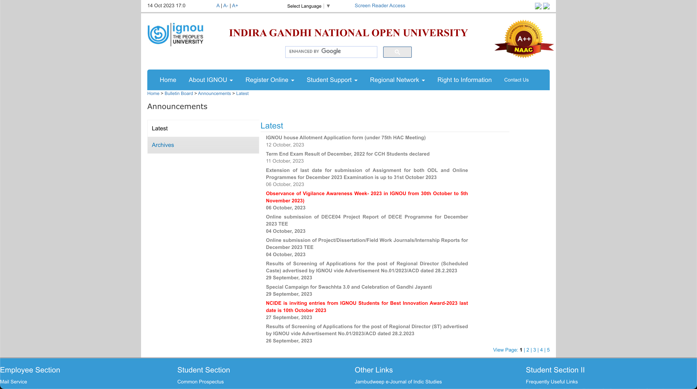
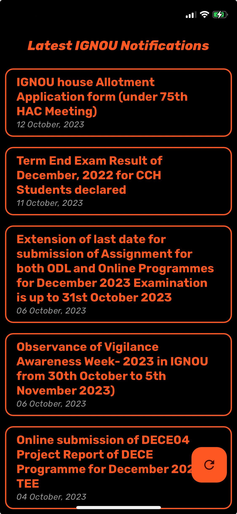

# IGNOU Notifications

A Flutter application to notify IGNOU notifications with a minimal UI. The usual [notification screen](http://ignou.ac.in/ignou/bulletinboard/announcements/latest/1) is a boring view and not user-friendly!

This application makes that look like below, and much more features have been planned for development!

Other features under development:

1. Notification for new announcements
2. View and read the announcements in the app itself
3. View Monthly announcements grouped
4. Search the list
